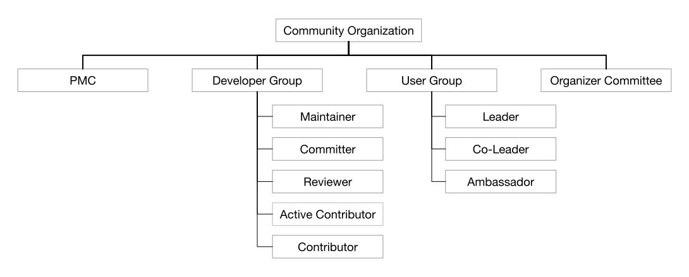

# TiDB Community

Welcome to the TiDB Community! The main objective is to help members of the
TiDB community who share similar interests to learn from and collaborate with
each other.

Your journey of becoming a contributor and committer starts from here:
improving docs, improving code, giving talks, organizing meetups, etc.

## Architecture

## TiDB User Group

* Governance
* Communicating

## TiDB Developer Group

### Governance

* [Contributor Covenant Code of Conduct](./CODE_OF_CONDUCT.md)
* [Become a Committer](./become-a-committer.md)

### Communicating

Communication within the TiDB community abides by the [Contributor Covenant
Code of Conduct](./CODE_OF_CONDUCT.md). You can reach out to the community
members via any one of the following ways:

* Slack: [https://pingcap.com/tidbslack](https://pingcap.com/tidbslack)
* Social Media
    * Blog: The TiDB Blog is a great resource pool to find content! We post the
      latest TiDB news including new releases and technical articles there.
      Check out this page: [blog](https://pingcap.com/blog) or
      [blog-cn](https://pingcap.com/blog-cn)
    * Stack Overflow: [https://stackoverflow.com/questions/tagged/tidb](https://stackoverflow.com/questions/tagged/tidb)
    * Twitter: [https://twitter.com/PingCAP](https://twitter.com/PingCAP)
    * Facebook: [https://www.facebook.com/pingcap2015](https://www.facebook.com/pingcap2015)
    * Reddit: [https://www.reddit.com/r/TiDB](https://www.reddit.com/r/TiDB)
    * Google Groups: [https://groups.google.com/forum/#!forum/tidb-user](https://groups.google.com/forum/#!forum/tidb-user)
    * [TiDB Weekly](https://pingcap.com/weekly): This weekly newsletter
      highlights content from the community along with the latest TiDB weekly
      update & news. Read the TiDB Weekly archives to catch up on all of the
      latest TiDB updates and hacks.

### How to contribute

Contributions are welcomed and greatly appreciated. See
[CONTRIBUTING.md](./CONTRIBUTING.md)
for details on submitting patches and the contribution workflow.

You can start by finding an existing issue with the
[help-wanted](https://github.com/pingcap/tidb/issues?q=is%3Aissue+is%3Aopen+label%3A%22help+wanted%22)
label in the tidb repo. These issues are well suited for new contributors. BTW,
there's always a need for more test coverage. You can also start with an area
that has [low coverage](https://codecov.io/gh/pingcap/tidb).

You can also join one of the [active working groups](./working-groups) to
participate in a community activity. Start attending working group meetings and
join the slack channel.

Some useful documents:

* [Github Workflow](./contributors/workflow.md)
* [SRE-BOT Command Help](./contributors/command-help.md)

## Learning Resources

* [How we build TiDB](https://www.pingcap.com/blog/2016-10-17-how-we-build-tidb/)
* [A Brief Introduction of TiDB](https://www.pingcap.com/blog/2017-05-23-perconalive17/)
* [https://pingcap.com/docs](https://pingcap.com/docs)
* [TiDB 源码阅读系列文章](https://pingcap.com/blog-cn/#TiDB-%E6%BA%90%E7%A0%81%E9%98%85%E8%AF%BB), in chinese
* [TiKV 源码解析系列文章](https://pingcap.com/blog-cn/#TiKV-%E6%BA%90%E7%A0%81%E8%A7%A3%E6%9E%90), in chinese

## TiDB Roadmap

See [TiDB Roadmap](https://pingcap.com/docs/v2.1/roadmap/#tidb-roadmap).

## Tutorial Content

If you're interested in writing a tutorial for TiDB, please contact us:
[community@pingcap.com](mailto:community@pingcap.com)

## License

TiDB Community is under the Apache 2.0 license. See the
[LICENSE](./LICENSE.md) file for details.

## Acknowledgements

Thank you to the [Kubernetes](https://github.com/kubernetes/community),
[Apache](http://activemq.apache.org/becoming-a-committer.html) and
[Docker](https://github.com/docker/community) community pages for providing us
with inspiration.
